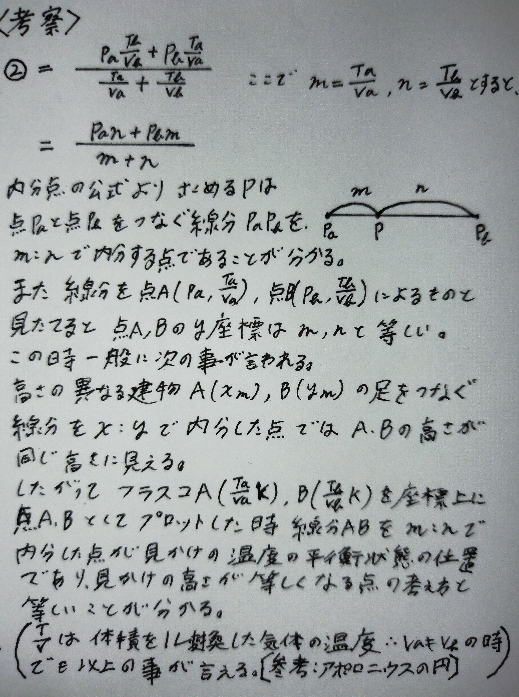

# internal-division-pressure
異なる条件のフラスコを連結したときの最終圧力を、内分の視点から解釈したノート。  
A note interpreting the equilibrium pressure of connected flasks using internal division.

# 内分による気体平衡圧力の解釈  
*A geometrical interpretation of equilibrium pressure using internal division*

---

## 概要 / Overview
異なる条件にある二つのフラスコを連結したときの最終圧力は、通常は**連立方程式**で解かれます。  
ここでは「**内分**」の視点を導入し、気圧・体積・温度の関係が**線分の内分点**として表せることを示します。  
美しさを感じていただけたら幸いです。

---

## 前提 / Assumptions
- 理想気体（\(PV=nRT\)）。  
- 各フラスコは剛体容器（体積一定 \(V_A, V_B\)）。  
- 連結後も各容器はそれぞれ温度一定（例えば恒温槽で \(T_A, T_B\) に保持）。  
- 重力差・流速の運動エネルギー・反応は無視。

---

## 問題設定 / Problem
- Flask A: 体積 \(V_A\), 圧力 \(P_A\), 温度 \(T_A\)  
- Flask B: 体積 \(V_B\), 圧力 \(P_B\), 温度 \(T_B\)  
- コックを開いた後、両容器の圧力は共通の \(P\) で平衡。  
- 目的：最終圧力 \(P\) を求める。

---

## 結論（内分式） / Result (Internal-Division Formula)

$$
P =
\frac{P_A V_A / T_A + P_B V_B / T_B}
     {V_A / T_A + V_B / T_B}
$$

これは **\(P_A\) と \(P_B\) を \(\dfrac{V_A}{T_A} : \dfrac{V_B}{T_B}\)** の重みで**内分**した点です。  

すなわち

$$
P = w_A P_A + w_B P_B,\quad
w_A=\frac{V_A/T_A}{V_A/T_A+V_B/T_B},\;
w_B=\frac{V_B/T_B}{V_A/T_A+V_B/T_B}
$$

等価に

$$
\frac{|P_A - P|}{|P - P_B|}
= \frac{V_B/T_B}{V_A/T_A}
$$

---

## 1行導出 / One-line Derivation
総物質量保存：

$$
\frac{P_A V_A}{RT_A} + \frac{P_B V_B}{RT_B}
= \underbrace{\frac{P V_A}{RT_A}}_{\text{A内の最終モル}} 
+ \underbrace{\frac{P V_B}{RT_B}}_{\text{B内の最終モル}}
$$

\(R\) を消去して \(P\) について解けば上の式。

---

## サニティチェック / Sanity Checks
- **同温度** \(T_A=T_B=T\)：  

$$
P=\frac{P_A V_A + P_B V_B}{V_A+V_B}
$$

（**体積重みの内分**）。

- **同温度・同体積** \(T_A=T_B,\;V_A=V_B\)：  

$$
P=\frac{P_A+P_B}{2}
$$

（単純平均）。

- **片方が真空** \(P_B=0\)：  

$$
P=\frac{P_A}{1+\frac{V_B T_A}{V_A T_B}}
$$

（拡散先の容器が大・低温ほど \(P\) は小さく）。

---

## メッセージ / Message
複雑に見える気体の平衡も、視点を変えると**一本の線分の内分**にすぎない。  
この「内分的解釈」は、計算を簡潔にするだけでなく、**構造の美**を露わにします。

---

## English (short)
**Result.**  

$$
P =
\frac{P_A V_A / T_A + P_B V_B / T_B}
     {V_A / T_A + V_B / T_B}
= w_A P_A + w_B P_B,\;
w_{A,B} \propto \frac{V_{A,B}}{T_{A,B}}
$$

Thus the equilibrium pressure is the **internal-division point** between \(P_A\) and \(P_B\) with weights \(V/T\).  

One-line derivation: total moles conserved; solve \(P\) from  
\(P_A V_A/RT_A+P_B V_B/RT_B=P V_A/RT_A+P V_B/RT_B\).

---

## Appendix: Handwritten Notes
This is the original handwritten derivation and visualization of the internal-division approach.

